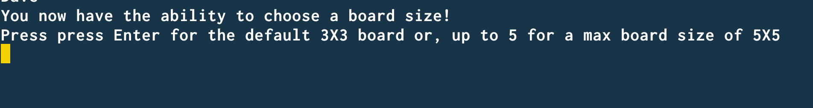
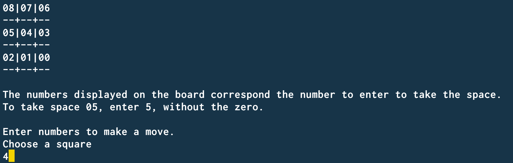
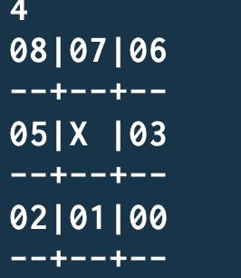
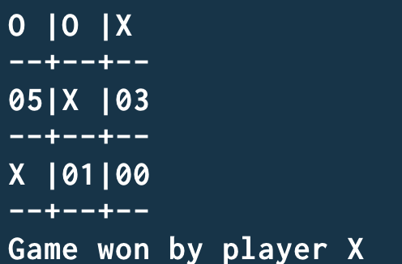
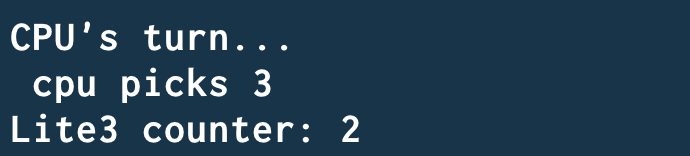
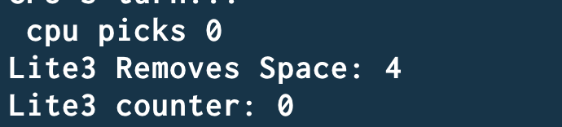
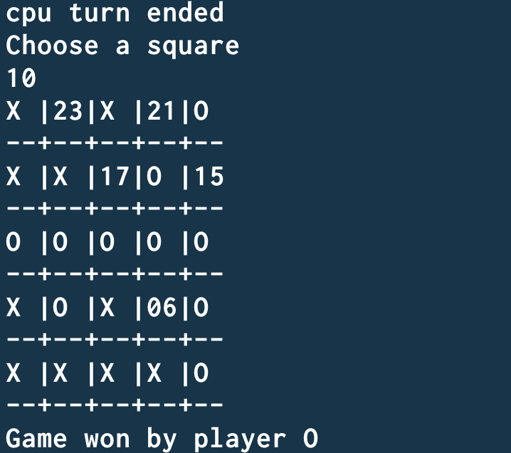
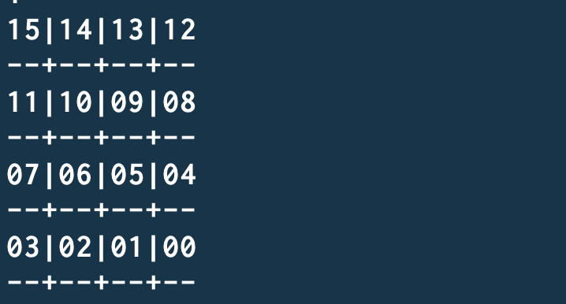
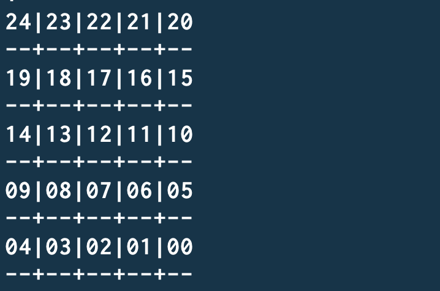

 Welcome to Tic-Tac_toe!  
>Installation and Running
 

To run, clone repo, cd into directory and run this command: "ruby src/main.rb"
 
 

>Game play and features
>
You have the ability to select between playing against an other human or a CPU.

Both human players will have the opportunity to enter their names, select their mark and select their position as player one or two.
* Note: player one always goes first.

* Note: Second players mark and position are automatically selected to the opposite of what player one choose. Player two only need to enter their name.

As a player, you will be able to pick board sizes from 3x3 by default up to 5x5.

There are two versions of the game, classic Tic-tac-toe and Lite 3.

>Classic Tic-tac-toe game play

Players will be greeted with the game board full of numbers, which represent the number to enter on the keyboard in the terminal window.
* Note: There is no need to enter the number as 01, 00, 05, ect. Enter single digit numbers omitting the zero. The zero is added for formatting purposes only.

As players chose spaces the numbers will disappear and be replaced with the mark that the player chose. Players will be prompted to choose again if the space is already taken.

As the game progresses, players can win by placing consecutive marks across any row, down any column or across any diagonal path as illustrated below.

* Note: The game now displays the name entered as the winner instead of the mark.

Once the game is over the program exits and in order to play again, retype the command " ruby src/main.rb" to play again.

>Lite 3 gameplay

Lite 3 gameplay is similar to classic Tic-tac-toe but in this game style the game will remove a space that was previously occupied by a players mark after 3 turns. This game mode allows for a more dynamic play-through and a different way to strategize a win.

The Lite 3 counter increments by one every turn cycle, after both players take a turn.

Here we see the Lite 3 game remove an occupied space and reset the counter to zero.

Lite 3 game is won the same as classic Tic-tac-toe, row, column or diagonally. The same goes for all game board sizes.

>Custom boards

4X4 Board has 16 spaces

5X5 board has 25 spaces

>Conclusion

I hope you enjoy this version of Tic-tac-toe. Thank you for checking it out!

>License

The MIT License (MIT)

Copyright (c) 2013-2018 The Open Web Application Security Project

Permission is hereby granted, free of charge, to any person obtaining a copy of this software and associated documentation files (the "Software"), to deal in the Software without restriction, including without limitation the rights to use, copy, modify, merge, publish, distribute, sublicense, and/or sell copies of the Software, and to permit persons to whom the Software is furnished to do so, subject to the following conditions:

The above copyright notice and this permission notice shall be included in all copies or substantial portions of the Software.

THE SOFTWARE IS PROVIDED "AS IS", WITHOUT WARRANTY OF ANY KIND, EXPRESS OR IMPLIED, INCLUDING BUT NOT LIMITED TO THE WARRANTIES OF MERCHANTABILITY, FITNESS FOR A PARTICULAR PURPOSE AND NONINFRINGEMENT. IN NO EVENT SHALL THE AUTHORS OR COPYRIGHT HOLDERS BE LIABLE FOR ANY CLAIM, DAMAGES OR OTHER LIABILITY, WHETHER IN AN ACTION OF CONTRACT, TORT OR OTHERWISE, ARISING FROM, OUT OF OR IN CONNECTION WITH THE SOFTWARE OR THE USE OR OTHER DEALINGS IN THE SOFTWARE.
